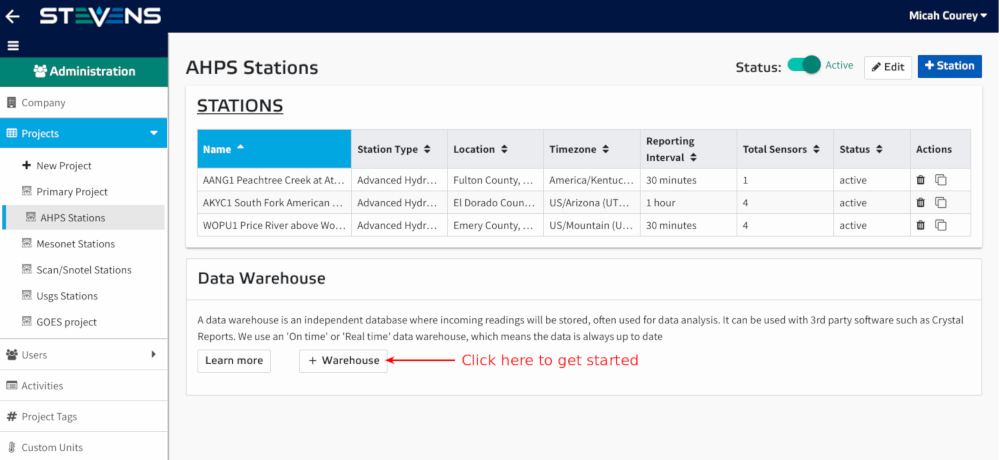

# Data Warehouse Setup

A data warehouse is an independent database where incoming readings will be stored and is often used for data analysis. Setting up a data warehouse will allow you to import your data into 3rd party data-management software.  offers an 'On time' or 'Real time' data warehouse, which means the data is always up to date. Once your data warehouse is setup it will automatically begin collecting new data at regular intervals. Note that only Project Administrators have access to the Data Warehouse feature.

## Prerequisites

#### MySQL Installation

The Data Warehouse feature provides a means for transferring your data to your own external database. The feature currently supports MySQL databases only. In order to use the Data Warehouse feature you must have MySQL installed on a server. MySQL is an open-source relational database management system and is compatible with Windows, macOS and Linux/Unix operating systems. Follow <a href="https://dev.mysql.com/doc/refman/5.7/en/installing.html" target="_blank">MySQL's official installation guide</a> to install MySQL on your computer. 

#### Terminal Emulator

In order to execute the database configuration commands, you will need a terminal emulator installed on your server. While macOS and Linux operating systems have a terminal emulator installed by default, Windows systems do not. <a href="https://dev.mysql.com/doc/refman/5.7/en/installing.html" target="_blank">Cmder</a> is a popular open-source Windows terminal emulator. 

Once you have MySQL and a terminal emulator installed on your system, follow the steps below to create and configure your data warehouse.

## Data Warehouse Setup Steps

1.  Before we create our data warehouse we need to configure the new installation of MySQL on your server. Begin by accessing the MySQL shell by executing the following command from a terminal emulator on your server and entering the MySQL root user password that you configured during installation:

        mysql -u root -p
  
2.  Now that you're logged in to the MySQL shell as root user type the following SQL command to create a new database for your warehouse:

        CREATE DATABASE database_name;

3.  Next we will create a non-root user and password which will be used by  to access your MySQL database. To create a user issue the following command from the MySQL shell:

        CREATE USER 'newuser'@'localhost' IDENTIFIED BY 'password';

    > replace 'new user' and 'password' with a username and password but do not remove the quote marks.

4.  Your new user has been created but the user doesn't have access to the database. Next we will grant the user all privileges to the database. issue the following command replacing database_name and newuser with the name of the database we created in step 2 and the user we created in step 3:

        GRANT ALL PRIVILEGES ON database_name . * TO 'newuser'@'*';

5.  Now that you have configured permissions for your new user, issue the following command to reload all the privileges:

        FLUSH PRIVILEGES;

6.  Now that our database is configured, we need to test that our new user can access our database remotely. Access a computer that is not connected to the same network as your database server. Execute the following command in the terminal replacing newuser with the user you created in step 3 and the x's with your server's ip address:

        mysql -u newuser -p -h xxx.xxx.xxx.xxx

7.  Enter your password when prompted. You should now see the MySQL command prompt `mysql>` which means we have successfully connected to the database remotely and our setup was successful.

8.  Log into your  account, click your user menu in the top right corner and select 'Administration'.
    
    

9.  From the Administration side menu select the project that you would like to create a Data Warehouse in.

    

10.  Scroll down to the Data Warehouse info card, click the '+ Warehouse' button to get started.

    
    

11.  Enter your database configuration in the warehouse setup form.

     

    - **Database:** Enter the name of the database we created in step 2.
    - **Host:** Enter your server's IP address.
    - **Port:** Enter the default MySQL port which is `3306`
    - **User:** Enter the name of the user we created in step 3.
    - **Password:** Enter the password we created for the user in step 3.

11.  Click the 'Create' button. You should now see an Advanced Configurations section on your Administration Project page. Click to expand the Data Warehouse item.

     

12. We can now configure our database tables. To add a table, click the '+ Table' button.

13. Give the table a name and select a single or multiple parameters from the list. Not that all parameters added to the table will report their readings to this single database table. After you've finished selecting parameters click the 'Create Table' button.

    

14. Continue adding tables by following the previous two steps for as many tables as you require.

15. As your stations report data to  you should begin to see data saved to your server's database. Note that each table you created through  will not be created in your server database until the station reports new readings to this table. Now that the data is in your hands in your new database, you can import your data into any 3rd party data-management software.
  
