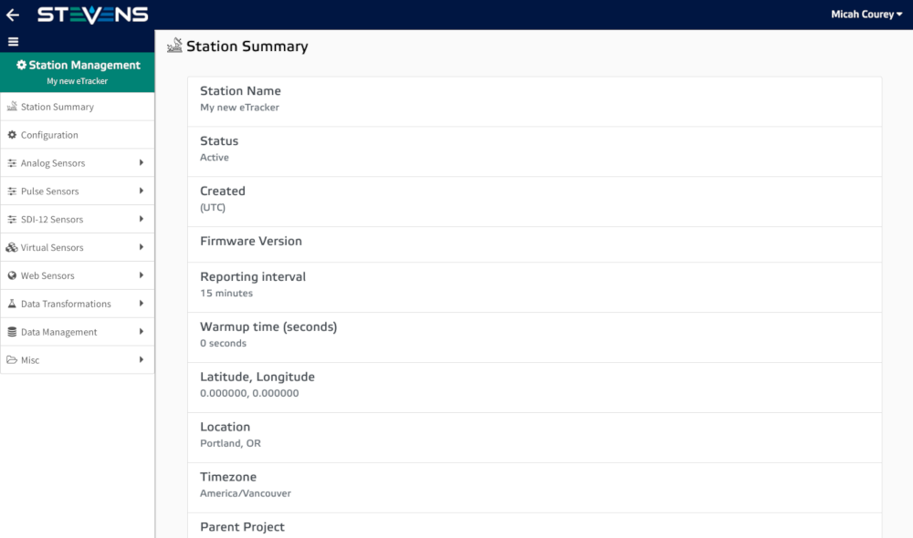

# Creating a New Station

 provides several different types of stations that you can add to your project. Some station types require that you have access to your own data logging hardware such as the eTracker and Cell-Net station types.  also offers a variety of station types that collect data from third-party data sources and do not require any additional hardware to setup. Note that because external station types are maintained by third parties, we cannot guarantee the frequency or quality of the data transmitted from these external data sources. Here is a list of  station types:

### Internal Data Source Station Types

-   Stevens Cell-Net + Stevens DLight
-   Stevens eTracker
-   Stevens AVO
-   Stevens Cell-Net
-   Stevens Cell-Net + MetOne AutoMet + MetOne Weather
-   Stevens Cell-Net + MetOne AutoMet + MetOne E-Sampler
-   Stevens Cell-Net + MetOne

### External Data Source Station Types

<ul>
  <li><a href="http://www.goes.noaa.gov/" target="_blank">GOES</a></li>
  <li><a href="https://water.weather.gov/ahps/" target="_blank">Advanced Hydrologic Prediction Service (AHPS)</a></li>
  <li><a href="https://waterdata.usgs.gov/nwis" target="_blank">US Geological Survey (USGS)</a></li>
  <li><a href="http://mesowest.utah.edu/" target="_blank">Mesonet</a></li>
  <li><a href="https://www.wcc.nrcs.usda.gov/snow/" target="_blank">SNOTEL</a></li>
  <li><a href="https://www.wcc.nrcs.usda.gov/scan/" target="_blank">SCAN</a></li>
</ul>

After determining what type of station you would like to create, follow the steps below to get started.

### Creating a New Station

1.  Navigate to the Project Navigator page. Click the '+ Station' button in the top right corner of the map.
    
2.  Select the type of station you would like to create.
    
3.  Setup your station's basic configurations:
    
    -   For internal station types, enter the basic station configurations
        -   **Station Name**: Give your station a unique name to identify it by.
        -   **Station Unique Identifier (SUI)**: The Station Unique Identifier is a unique string of numbers and letters that identifies each device or external station. You can find the SUI on the side of your telemetry device's case. 
        -   **Reporting Interval**: This setting controls how often the station reports it's data to the cloud.
        -   **Station Location**: The name of the city or region of your station's physical location. Note that GPS location information can be configured from the station's management page after the initial setup.
        -   **Station Visibility:** This settings controls whether your station is visibly to public users not associated with your organization.
    -   For external station types follow the provided instructions for searching for the external station that you would like to log data from.
4.  Select your timezone by clicking the green dot that is closest to your station's physical location or click 'Skip for now'.
    
5.  Review your new station's configurations.
    
    -   For external station types sensors will be auto generated for you. For internal station types no further configuration is necessary.
6.  Click 'Submit' and you will be taken to your new stations 'Station Management' page.
    